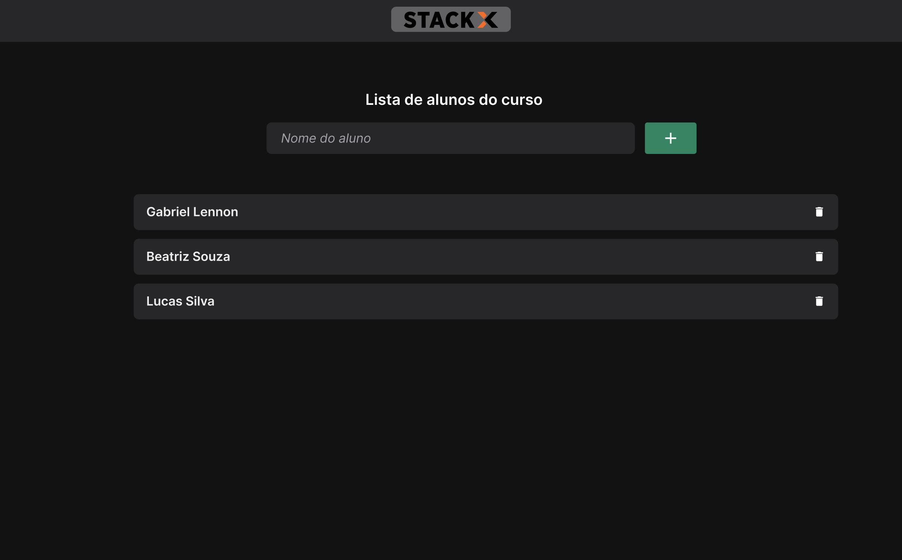

<h1 align="center" style="color: rgb(255, 106, 7)"> Projeto React StackX </h1>

<h3 align="center"> Meu primeiro Projeto em react, como aluno da StackX.</h3>

 
            

 

## :writing_hand: descrição:
* Nesse projeto e possível adicionar o nome de uma pessoa a lista, e também remove-la.
Embora seja simples o projeto, foram aplicados muitos dos fundamentos de React.

## :gear:Tecnologias

Este projeto contem conceitos iniciais em React, com as seguintes tecnologias:

  - [ ReactJS ](https://reactjs.org/)
  - [Vite](https://vitejs.dev/guide/)
  - [CSS](https://www.w3schools.com/css/default.asp)
  
  E esses conceitos:
  
   - Componente
   - Módulos
   - Ganchos
   - estado

 

  ### " A qualidade mais valiosa para o aprendizado é uma atitude positiva." 